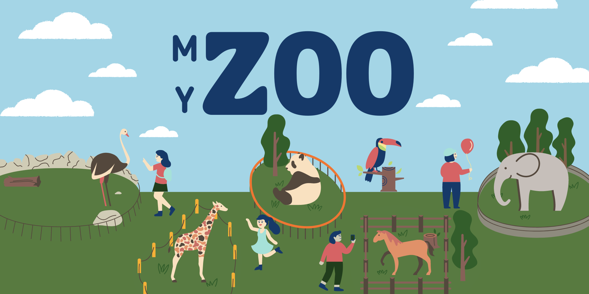
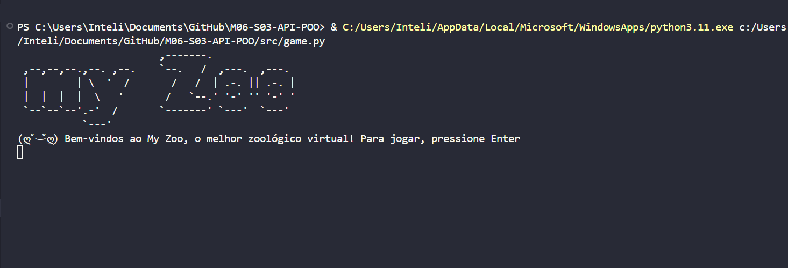
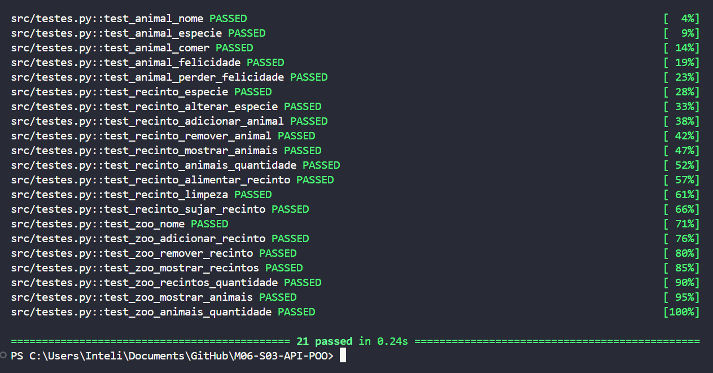
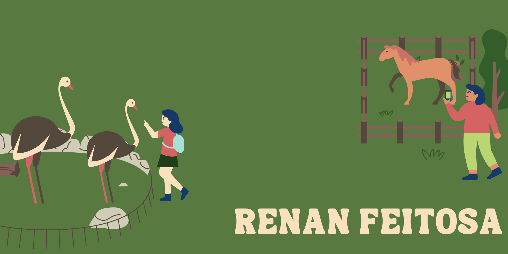

<div align="center">
  
</div>

<br>

## 🎯 Objetivo
&emsp;&emsp; O objetivo desta ponderada é desenvolver API baseada em TDD (Test Driven Development) para um jogo de zoológico virtual. O jogo consiste em um zoológico virtual onde o usuário pode adicionar vários recintos, animais e abrir o zoológico para visitantes.

&emsp;&emsp; Cada recinto tem um nivel de limpeza e cada animal tem um nível de felicidade, que diminuem no decorrer do tempo (ou deveriam, não consegui lançar a braba 😞). O usuário pode alimentar os animais para deixá-los feliz e limpar os recintos, atraindo mais visitantes e arrecadando mais dinheiro.

&emsp;&emsp; Para isso, o jogo apresenta 3 classes e funciona através de uma API de métodos das classes, que são chamados pelo usuário dentro das opções oferecidas nos menus.

### 🚀 Tecnologias Utilizadas
 


<br>

## ⚙️ Classes
&emsp;&emsp; O jogo é composto por 3 classes distintas, sendo elas:
- **Zoo**: Classe que representa o zoológico, contendo os recintos, animais e visitantes.
- **Recinto**: Classe que representa os recintos do zoológico, contendo os animais e o nível de limpeza.
- **Animal**: Classe que representa os animais do zoológico, contendo o nível de felicidade.

<br>

## 🔗 API
&emsp;&emsp; A API do jogo é composta por 11 métodos, sendo eles:
- **criar_zoo**: Método chamado durante a inicialização e tutorial do jogo para criar o zoológico.
- **abrir_zoo**: Método chamado para abrir o zoológico para visitantes, arrecadando dinheiro com base na limpeza dos recintos e felicidade dos animais.
- **get_zoo_info**: Método chamado para obter informações gerais do zoológico, como nome, dinheiro atual e número de recintos e animais.
- **get_recintos_info**: Método chamado para obter informações de todos os recintos do zoológico, como nome, nível de limpeza e número de animais.
- **criar_recinto**: Método chamado para criar um recinto no zoológico, inserindo qual tipo de espécie ele abrigará
- **deletar_recinto**: Método chamado para deletar um recinto do zoológico.
- **get_recinto_info**: Método chamado para obter informações de um recinto específico, como nome, nível de limpeza e número de animais.
- **criar_animal**: Método chamado para criar um animal dentro de um recinto específico, inserindo seu nome e espécie.
- **deletar_animal**: Método chamado para deletar um animal de um recinto.
- **alimentar_animais**: Método chamado para alimentar todos os animais de um recinto, aumentando o nível de felicidade deles em 1.
- **limpar_recinto**: Método chamado para limpar um recinto, aumentando o nível de limpeza dele para 10.

<br>

## 🎮 Jogo
&emsp;&emsp; O jogo é composto por diversos menus que aparecem no terminal, onde o usuário pode escolher entre as opções disponíveis para interagir com o zoológico. O jogo é baseado em texto e não possui interface gráfica.

<div align="center">
  
</div>


## ✅ Testes
&emsp;&emsp; Testes unitários e de integração servem para garantir o funcionamento correto de todas as classes e métodos do jogo, assegurando que o jogo retorne os resultados esperados e que funcione sem bugs. Os testes foram realizados utilizando a biblioteca **pytest**. Para rodá-los, basta executar o arquivo `testes.py`, encontrado no diretório src, através dos seguintes comandos:

```bash
cd src
python testes.py
```

### 📊 Output
<div align="center">
  
</div>

<br>

## 📂 Estrutura de Diretórios
&emsp;&emsp; A estrutura de diretórios do projeto está organizada da seguinte forma:
```bash
├── images
│   ├── footer.png
|   ├── game.png
│   ├── header.png
│   └── tests.png
├── src
│   ├── classes
│   │   ├── animal.py
│   │   ├── recinto.py
│   │   └── zoo.py
│   ├── api.py
│   ├── game.py
│   └── testes.py
└── README.md

```

<br>
<hr>
<br>

<div align="center">
  
</div>